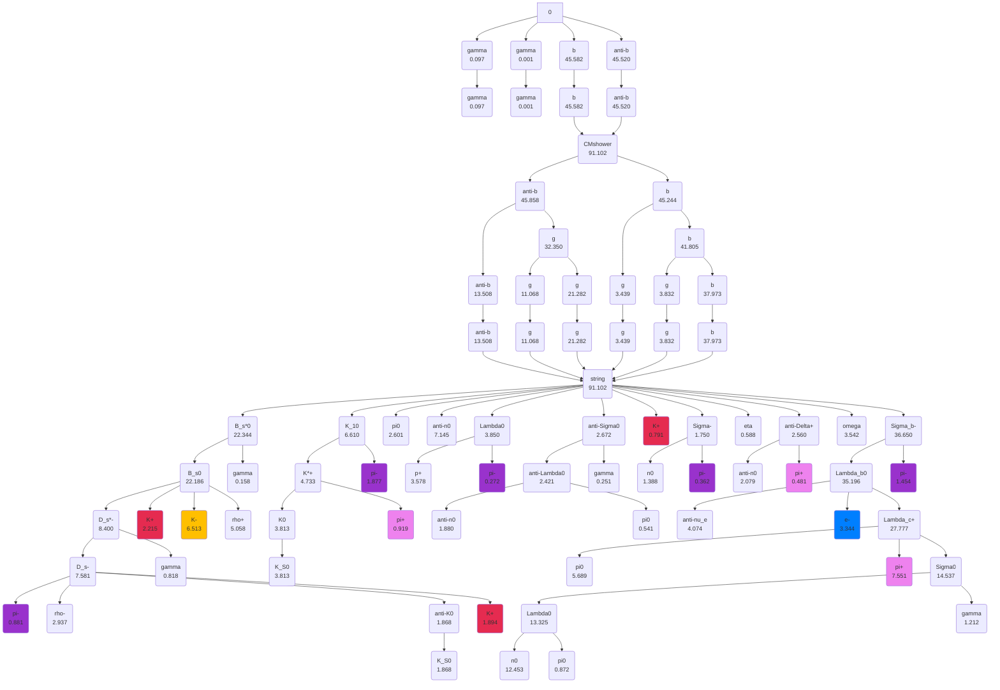
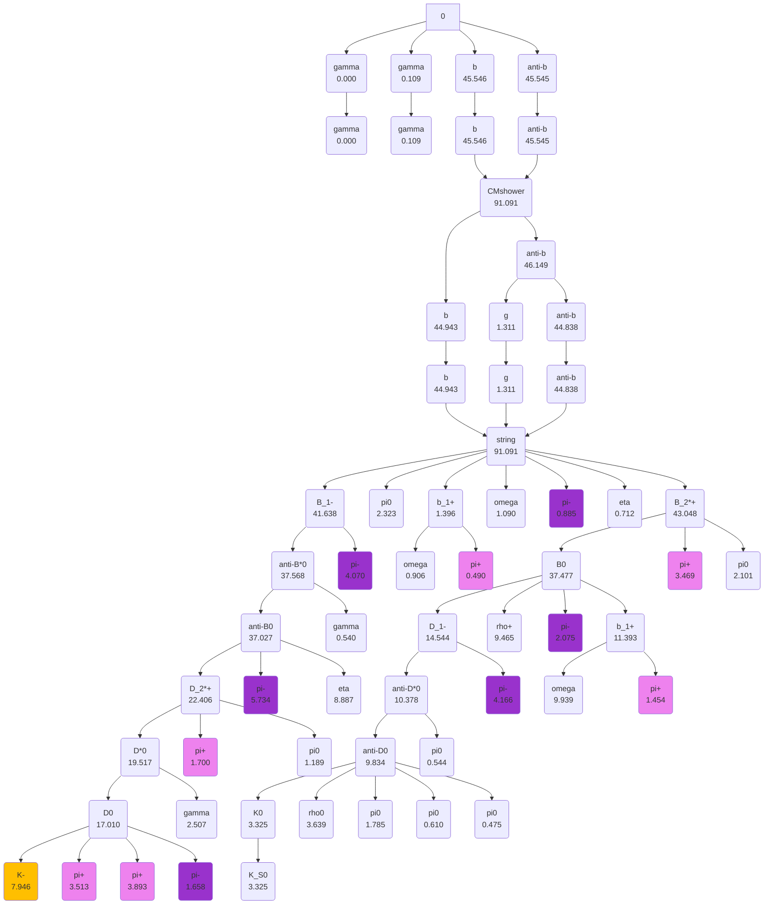
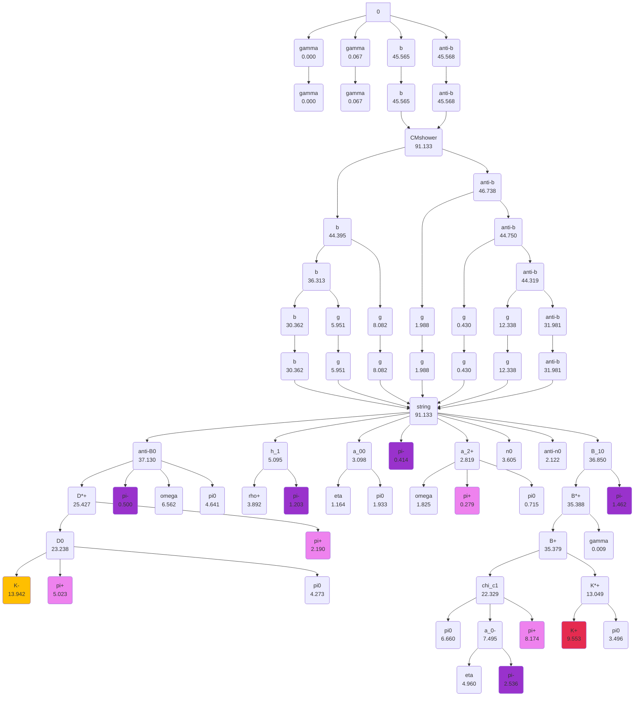
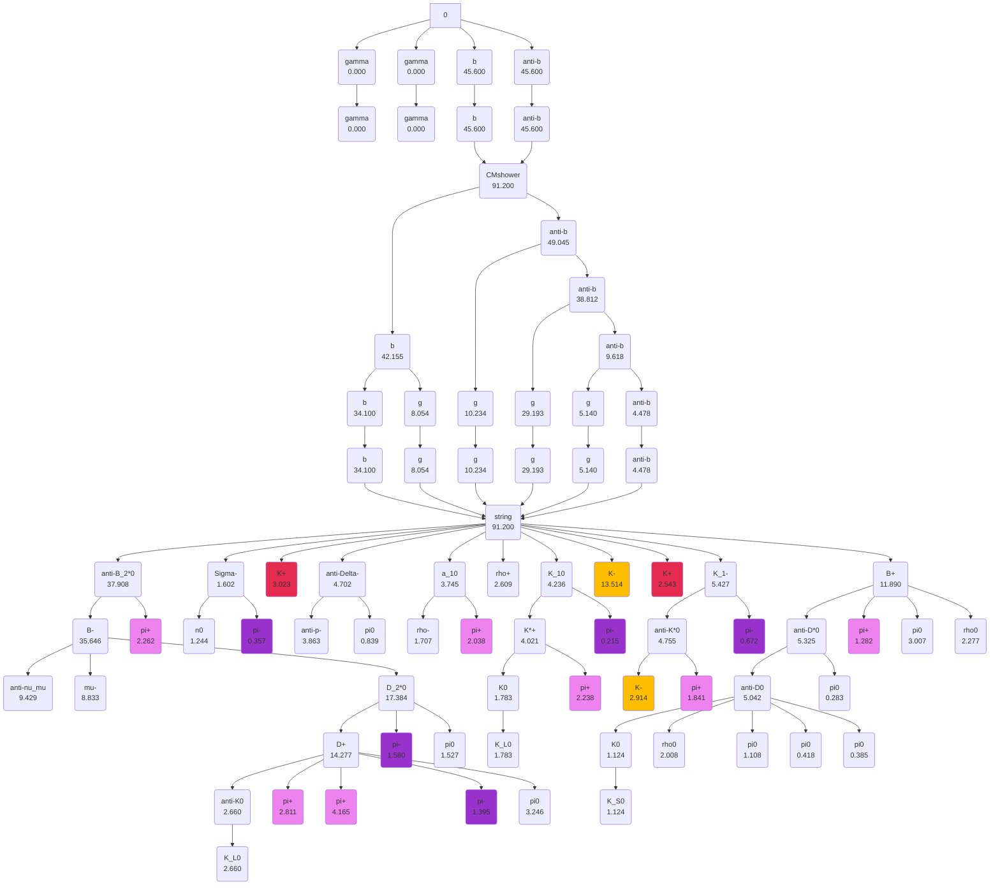
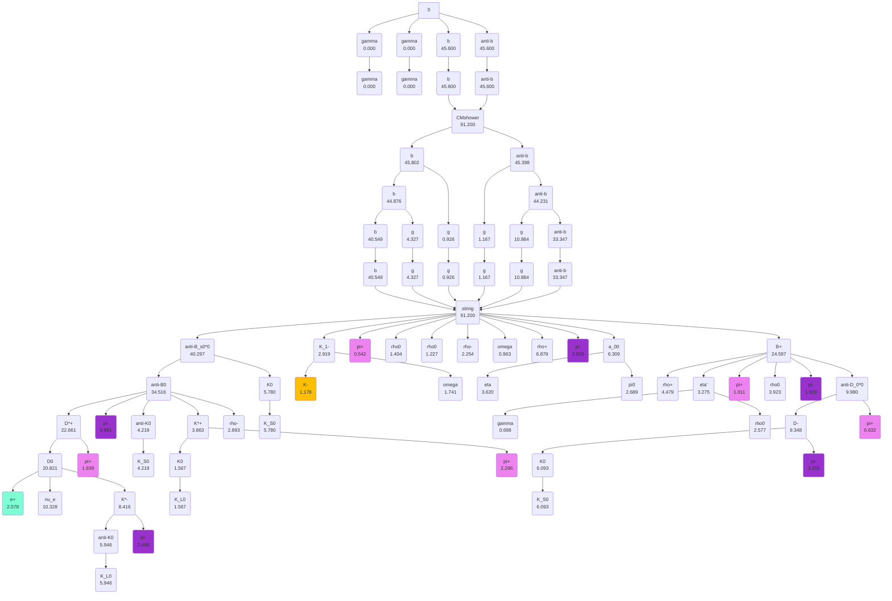
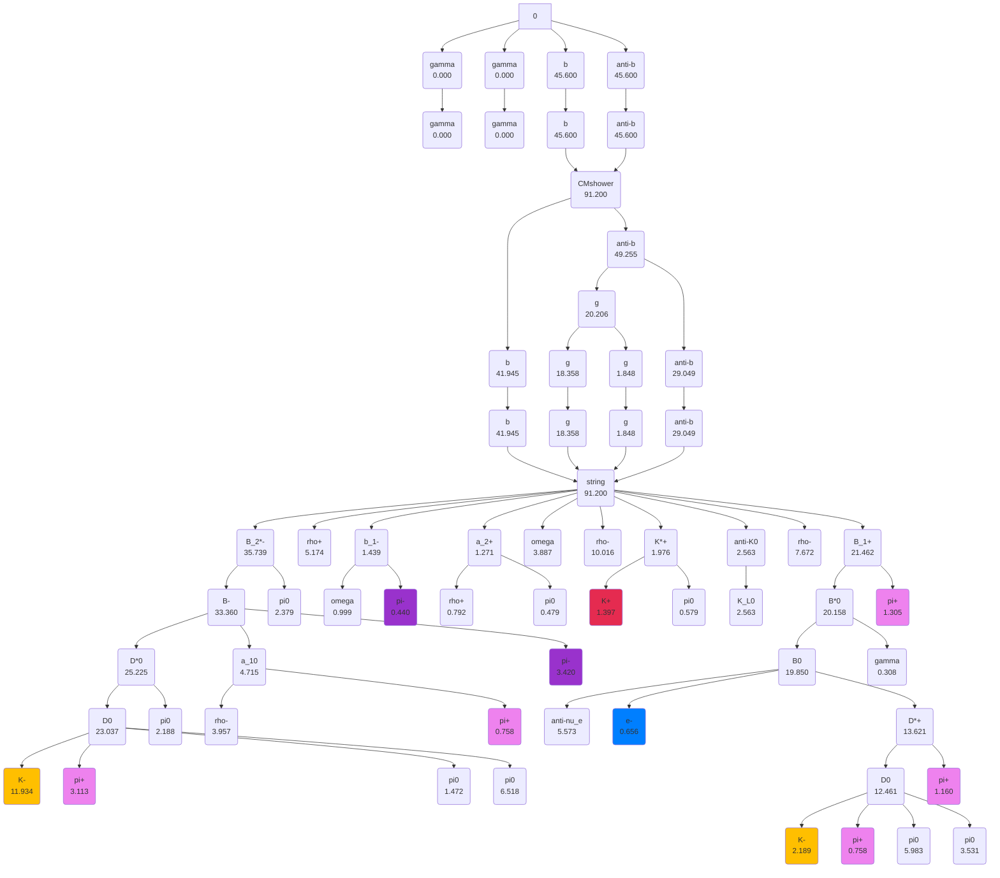
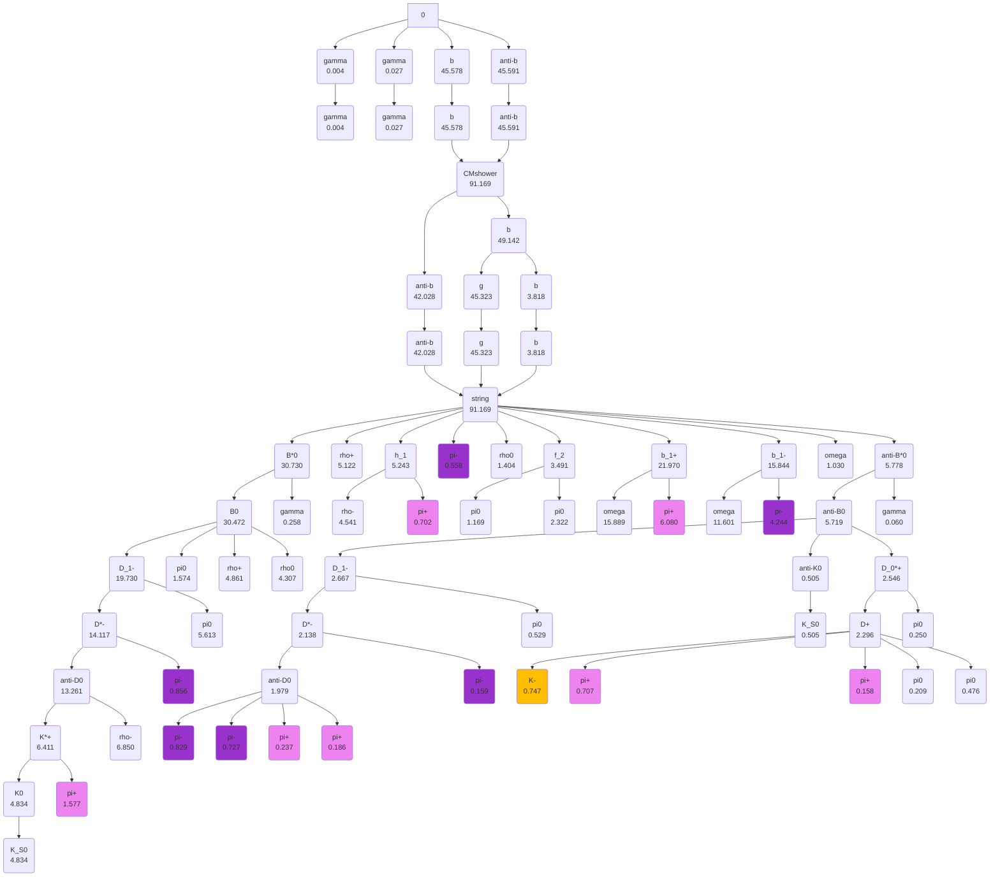
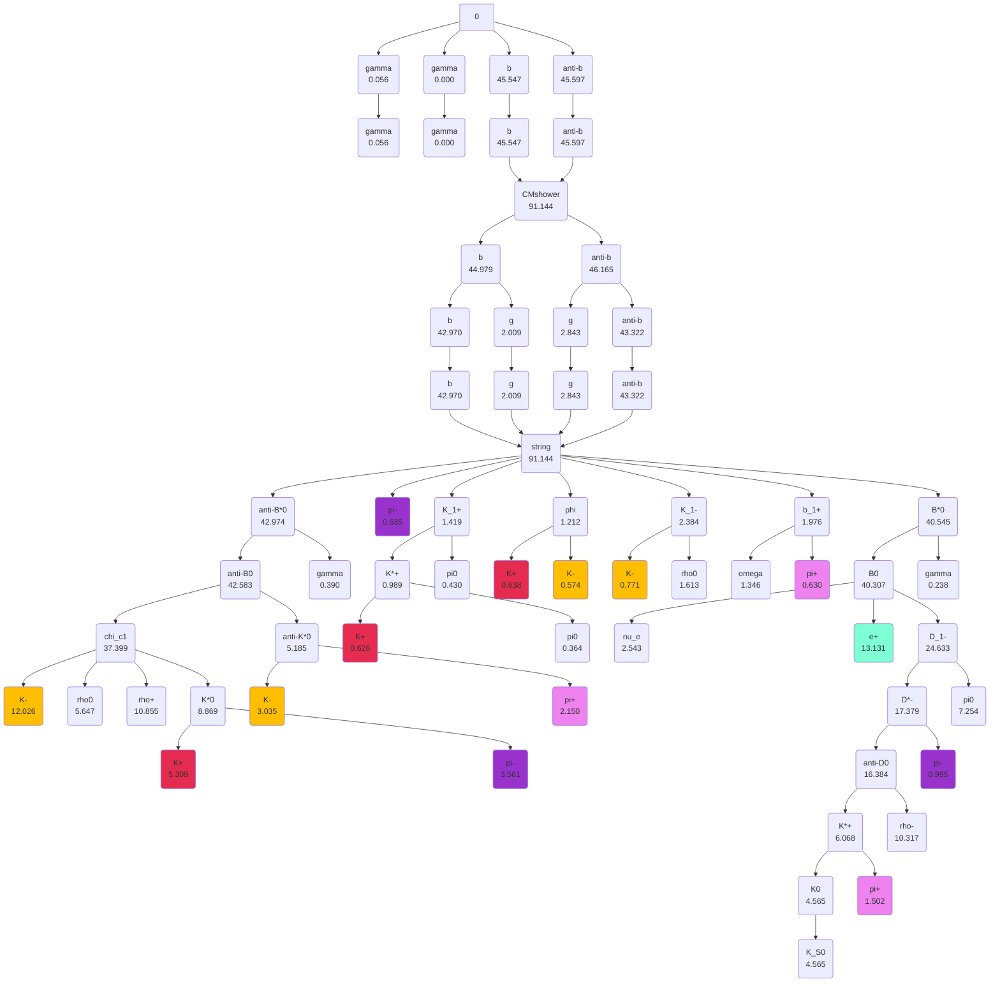
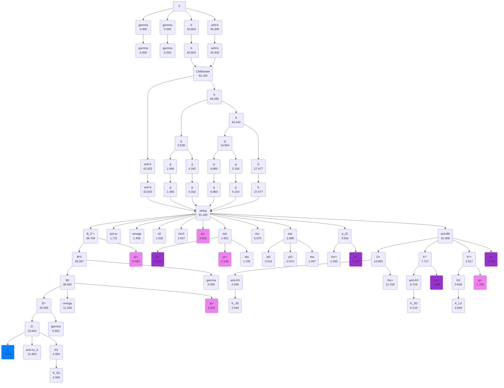
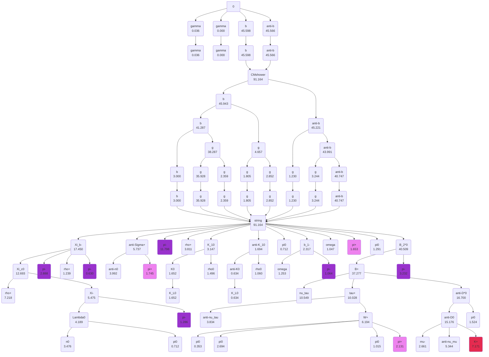

# THE FLOW CHART

```mermaid
graph TD
classDef Amaranth fill:#E52B50;
classDef Amber fill:#FFBF00;
classDef Amethyst fill:#9966CC;
classDef Apricot fill:#FBCCEB1;
classDef Azure fill:#007FFF;
classDef Aquamarine fill:#7FFFD4;
classDef Violet fill:#EE82EE;
classDef DarkOrchid fill:#9932CC;
0-->22(gamma<br>0.097 )
0-->23(gamma<br>0.001 )
0-->24(b<br>45.582 )
0-->25(anti-b<br>45.520 )
22-->26(gamma<br>0.097 )
23-->27(gamma<br>0.001 )
24-->28(b<br>45.582 )
25-->29(anti-b<br>45.520 )
28 & 29-->30(CMshower<br>91.102 )
30-->31(b<br>45.244 )
30-->32(anti-b<br>45.858 )
31-->33(b<br>41.805 )
31-->34(g<br>3.439 )
32-->35(anti-b<br>13.508 )
32-->36(g<br>32.350 )
33-->37(b<br>37.973 )
33-->38(g<br>3.832 )
36-->39(g<br>21.282 )
36-->40(g<br>11.068 )
35-->41(anti-b<br>13.508 )
40-->42(g<br>11.068 )
39-->43(g<br>21.282 )
34-->44(g<br>3.439 )
38-->45(g<br>3.832 )
37-->46(b<br>37.973 )
41 & 42 & 43 & 44 & 45 & 46-->47(string<br>91.102 )
47-->48(B_s*0<br>22.344 )
47-->49(K_10<br>6.610 )
47-->50(pi0<br>2.601 )
47-->51(anti-n0<br>7.145 )
47-->52(Lambda0<br>3.850 )
47-->53(anti-Sigma0<br>2.672 )
47-->54(K+<br>0.791 ):::Amaranth
47-->55(Sigma-<br>1.750 )
47-->56(eta<br>0.588 )
47-->57(anti-Delta+<br>2.560 )
47-->58(omega<br>3.542 )
47-->59(Sigma_b-<br>36.650 )
48-->60(B_s0<br>22.186 )
48-->61(gamma<br>0.158 )
49-->62(K*+<br>4.733 )
49-->63(pi-<br>1.877 ):::DarkOrchid
52-->66(p+<br>3.578 )
52-->67(pi-<br>0.272 ):::DarkOrchid
53-->68(anti-Lambda0<br>2.421 )
53-->69(gamma<br>0.251 )
55-->70(n0<br>1.388 )
55-->71(pi-<br>0.362 ):::DarkOrchid
57-->75(anti-n0<br>2.079 )
57-->76(pi+<br>0.481 ):::Violet
59-->80(Lambda_b0<br>35.196 )
59-->81(pi-<br>1.454 ):::DarkOrchid
60-->82(D_s*-<br>8.400 )
60-->83(K+<br>2.215 ):::Amaranth
60-->84(K-<br>6.513 ):::Amber
60-->85(rho+<br>5.058 )
62-->86(K0<br>3.813 )
62-->87(pi+<br>0.919 ):::Violet
68-->88(anti-n0<br>1.880 )
68-->89(pi0<br>0.541 )
80-->98(anti-nu_e<br>4.074 )
80-->99(e-<br>3.344 ):::Azure
80-->100(Lambda_c+<br>27.777 )
82-->101(D_s-<br>7.581 )
82-->102(gamma<br>0.818 )
86-->105(K_S0<br>3.813 )
100-->108(pi0<br>5.689 )
100-->109(pi+<br>7.551 ):::Violet
100-->110(Sigma0<br>14.537 )
101-->111(pi-<br>0.881 ):::DarkOrchid
101-->112(rho-<br>2.937 )
101-->113(anti-K0<br>1.868 )
101-->114(K+<br>1.894 ):::Amaranth
110-->121(Lambda0<br>13.325 )
110-->122(gamma<br>1.212 )
113-->125(K_S0<br>1.868 )
121-->126(n0<br>12.453 )
121-->127(pi0<br>0.872 )
```

# THE FLOW CHART

```mermaid
graph TD
classDef Amaranth fill:#E52B50;
classDef Amber fill:#FFBF00;
classDef Amethyst fill:#9966CC;
classDef Apricot fill:#FBCCEB1;
classDef Azure fill:#007FFF;
classDef Aquamarine fill:#7FFFD4;
classDef Violet fill:#EE82EE;
classDef DarkOrchid fill:#9932CC;
0-->383(gamma<br>0.000 )
0-->384(gamma<br>0.109 )
0-->385(b<br>45.546 )
0-->386(anti-b<br>45.545 )
383-->387(gamma<br>0.000 )
384-->388(gamma<br>0.109 )
385-->389(b<br>45.546 )
386-->390(anti-b<br>45.545 )
389 & 390-->391(CMshower<br>91.091 )
391-->392(b<br>44.943 )
391-->393(anti-b<br>46.149 )
393-->394(anti-b<br>44.838 )
393-->395(g<br>1.311 )
392-->396(b<br>44.943 )
395-->397(g<br>1.311 )
394-->398(anti-b<br>44.838 )
396 & 397 & 398-->399(string<br>91.091 )
399-->400(B_1-<br>41.638 )
399-->401(pi0<br>2.323 )
399-->402(b_1+<br>1.396 )
399-->403(omega<br>1.090 )
399-->404(pi-<br>0.885 ):::DarkOrchid
399-->405(eta<br>0.712 )
399-->406(B_2*+<br>43.048 )
400-->407(anti-B*0<br>37.568 )
400-->408(pi-<br>4.070 ):::DarkOrchid
402-->411(omega<br>0.906 )
402-->412(pi+<br>0.490 ):::Violet
406-->418(B0<br>37.477 )
406-->419(pi+<br>3.469 ):::Violet
406-->420(pi0<br>2.101 )
407-->421(anti-B0<br>37.027 )
407-->422(gamma<br>0.540 )
418-->428(D_1-<br>14.544 )
418-->429(rho+<br>9.465 )
418-->430(pi-<br>2.075 ):::DarkOrchid
418-->431(b_1+<br>11.393 )
421-->434(D_2*+<br>22.406 )
421-->435(pi-<br>5.734 ):::DarkOrchid
421-->436(eta<br>8.887 )
428-->439(anti-D*0<br>10.378 )
428-->440(pi-<br>4.166 ):::DarkOrchid
431-->443(omega<br>9.939 )
431-->444(pi+<br>1.454 ):::Violet
434-->445(D*0<br>19.517 )
434-->446(pi+<br>1.700 ):::Violet
434-->447(pi0<br>1.189 )
439-->450(anti-D0<br>9.834 )
439-->451(pi0<br>0.544 )
445-->457(D0<br>17.010 )
445-->458(gamma<br>2.507 )
450-->461(K0<br>3.325 )
450-->462(rho0<br>3.639 )
450-->463(pi0<br>1.785 )
450-->464(pi0<br>0.610 )
450-->465(pi0<br>0.475 )
457-->470(K-<br>7.946 ):::Amber
457-->471(pi+<br>3.513 ):::Violet
457-->472(pi+<br>3.893 ):::Violet
457-->473(pi-<br>1.658 ):::DarkOrchid
461-->474(K_S0<br>3.325 )
```

# THE FLOW CHART

```mermaid
graph TD
classDef Amaranth fill:#E52B50;
classDef Amber fill:#FFBF00;
classDef Amethyst fill:#9966CC;
classDef Apricot fill:#FBCCEB1;
classDef Azure fill:#007FFF;
classDef Aquamarine fill:#7FFFD4;
classDef Violet fill:#EE82EE;
classDef DarkOrchid fill:#9932CC;
0-->726(gamma<br>0.000 )
0-->727(gamma<br>0.067 )
0-->728(b<br>45.565 )
0-->729(anti-b<br>45.568 )
726-->730(gamma<br>0.000 )
727-->731(gamma<br>0.067 )
728-->732(b<br>45.565 )
729-->733(anti-b<br>45.568 )
732 & 733-->734(CMshower<br>91.133 )
734-->735(b<br>44.395 )
734-->736(anti-b<br>46.738 )
735-->737(b<br>36.313 )
735-->738(g<br>8.082 )
736-->739(anti-b<br>44.750 )
736-->740(g<br>1.988 )
737-->741(b<br>30.362 )
737-->742(g<br>5.951 )
739-->743(anti-b<br>44.319 )
739-->744(g<br>0.430 )
743-->745(anti-b<br>31.981 )
743-->746(g<br>12.338 )
741-->747(b<br>30.362 )
742-->748(g<br>5.951 )
738-->749(g<br>8.082 )
740-->750(g<br>1.988 )
744-->751(g<br>0.430 )
746-->752(g<br>12.338 )
745-->753(anti-b<br>31.981 )
747 & 748 & 749 & 750 & 751 & 752 & 753-->754(string<br>91.133 )
754-->755(anti-B0<br>37.130 )
754-->756(h_1<br>5.095 )
754-->757(a_00<br>3.098 )
754-->758(pi-<br>0.414 ):::DarkOrchid
754-->759(a_2+<br>2.819 )
754-->760(n0<br>3.605 )
754-->761(anti-n0<br>2.122 )
754-->762(B_10<br>36.850 )
755-->763(D*+<br>25.427 )
755-->764(pi-<br>0.500 ):::DarkOrchid
755-->765(omega<br>6.562 )
755-->766(pi0<br>4.641 )
756-->767(rho+<br>3.892 )
756-->768(pi-<br>1.203 ):::DarkOrchid
757-->769(eta<br>1.164 )
757-->770(pi0<br>1.933 )
759-->771(omega<br>1.825 )
759-->772(pi+<br>0.279 ):::Violet
759-->773(pi0<br>0.715 )
762-->774(B*+<br>35.388 )
762-->775(pi-<br>1.462 ):::DarkOrchid
763-->776(D0<br>23.238 )
763-->777(pi+<br>2.190 ):::Violet
774-->794(B+<br>35.379 )
774-->795(gamma<br>0.009 )
776-->796(K-<br>13.942 ):::Amber
776-->797(pi+<br>5.023 ):::Violet
776-->798(pi0<br>4.273 )
794-->805(chi_c1<br>22.329 )
794-->806(K*+<br>13.049 )
805-->809(pi0<br>6.660 )
805-->810(a_0-<br>7.495 )
805-->811(pi+<br>8.174 ):::Violet
806-->812(K+<br>9.553 ):::Amaranth
806-->813(pi0<br>3.496 )
810-->816(eta<br>4.960 )
810-->817(pi-<br>2.536 ):::DarkOrchid
```

# THE FLOW CHART

```mermaid
graph TD
classDef Amaranth fill:#E52B50;
classDef Amber fill:#FFBF00;
classDef Amethyst fill:#9966CC;
classDef Apricot fill:#FBCCEB1;
classDef Azure fill:#007FFF;
classDef Aquamarine fill:#7FFFD4;
classDef Violet fill:#EE82EE;
classDef DarkOrchid fill:#9932CC;
0-->1048(gamma<br>0.000 )
0-->1049(gamma<br>0.000 )
0-->1050(b<br>45.600 )
0-->1051(anti-b<br>45.600 )
1048-->1052(gamma<br>0.000 )
1049-->1053(gamma<br>0.000 )
1050-->1054(b<br>45.600 )
1051-->1055(anti-b<br>45.600 )
1054 & 1055-->1056(CMshower<br>91.200 )
1056-->1057(b<br>42.155 )
1056-->1058(anti-b<br>49.045 )
1057-->1059(b<br>34.100 )
1057-->1060(g<br>8.054 )
1058-->1061(anti-b<br>38.812 )
1058-->1062(g<br>10.234 )
1061-->1063(anti-b<br>9.618 )
1061-->1064(g<br>29.193 )
1063-->1065(anti-b<br>4.478 )
1063-->1066(g<br>5.140 )
1059-->1067(b<br>34.100 )
1060-->1068(g<br>8.054 )
1062-->1069(g<br>10.234 )
1064-->1070(g<br>29.193 )
1066-->1071(g<br>5.140 )
1065-->1072(anti-b<br>4.478 )
1067 & 1068 & 1069 & 1070 & 1071 & 1072-->1073(string<br>91.200 )
1073-->1074(anti-B_2*0<br>37.908 )
1073-->1075(Sigma-<br>1.602 )
1073-->1076(K+<br>3.023 ):::Amaranth
1073-->1077(anti-Delta-<br>4.702 )
1073-->1078(a_10<br>3.745 )
1073-->1079(rho+<br>2.609 )
1073-->1080(K_10<br>4.236 )
1073-->1081(K-<br>13.514 ):::Amber
1073-->1082(K+<br>2.543 ):::Amaranth
1073-->1083(K_1-<br>5.427 )
1073-->1084(B+<br>11.890 )
1074-->1085(B-<br>35.646 )
1074-->1086(pi+<br>2.262 ):::Violet
1075-->1087(n0<br>1.244 )
1075-->1088(pi-<br>0.357 ):::DarkOrchid
1077-->1089(anti-p-<br>3.863 )
1077-->1090(pi0<br>0.839 )
1078-->1091(rho-<br>1.707 )
1078-->1092(pi+<br>2.038 ):::Violet
1080-->1095(K*+<br>4.021 )
1080-->1096(pi-<br>0.215 ):::DarkOrchid
1083-->1097(anti-K*0<br>4.755 )
1083-->1098(pi-<br>0.672 ):::DarkOrchid
1084-->1099(anti-D*0<br>5.325 )
1084-->1100(pi+<br>1.282 ):::Violet
1084-->1101(pi0<br>3.007 )
1084-->1102(rho0<br>2.277 )
1085-->1103(anti-nu_mu<br>9.429 )
1085-->1104(mu-<br>8.833 ):::Apricot
1085-->1105(D_2*0<br>17.384 )
1095-->1112(K0<br>1.783 )
1095-->1113(pi+<br>2.238 ):::Violet
1097-->1114(K-<br>2.914 ):::Amber
1097-->1115(pi+<br>1.841 ):::Violet
1099-->1116(anti-D0<br>5.042 )
1099-->1117(pi0<br>0.283 )
1105-->1122(D+<br>14.277 )
1105-->1123(pi-<br>1.580 ):::DarkOrchid
1105-->1124(pi0<br>1.527 )
1112-->1127(K_L0<br>1.783 )
1116-->1128(K0<br>1.124 )
1116-->1129(rho0<br>2.008 )
1116-->1130(pi0<br>1.108 )
1116-->1131(pi0<br>0.418 )
1116-->1132(pi0<br>0.385 )
1122-->1135(anti-K0<br>2.660 )
1122-->1136(pi+<br>2.811 ):::Violet
1122-->1137(pi+<br>4.165 ):::Violet
1122-->1138(pi-<br>1.395 ):::DarkOrchid
1122-->1139(pi0<br>3.246 )
1128-->1142(K_S0<br>1.124 )
1135-->1151(K_L0<br>2.660 )
```

# THE FLOW CHART

```mermaid
graph TD
classDef Amaranth fill:#E52B50;
classDef Amber fill:#FFBF00;
classDef Amethyst fill:#9966CC;
classDef Apricot fill:#FBCCEB1;
classDef Azure fill:#007FFF;
classDef Aquamarine fill:#7FFFD4;
classDef Violet fill:#EE82EE;
classDef DarkOrchid fill:#9932CC;
0-->1380(gamma<br>0.000 )
0-->1381(gamma<br>0.000 )
0-->1382(b<br>45.600 )
0-->1383(anti-b<br>45.600 )
1380-->1384(gamma<br>0.000 )
1381-->1385(gamma<br>0.000 )
1382-->1386(b<br>45.600 )
1383-->1387(anti-b<br>45.600 )
1386 & 1387-->1388(CMshower<br>91.200 )
1388-->1389(b<br>45.802 )
1388-->1390(anti-b<br>45.398 )
1389-->1391(b<br>44.876 )
1389-->1392(g<br>0.926 )
1390-->1393(anti-b<br>44.231 )
1390-->1394(g<br>1.167 )
1391-->1395(b<br>40.549 )
1391-->1396(g<br>4.327 )
1393-->1397(anti-b<br>33.347 )
1393-->1398(g<br>10.884 )
1395-->1399(b<br>40.549 )
1396-->1400(g<br>4.327 )
1392-->1401(g<br>0.926 )
1394-->1402(g<br>1.167 )
1398-->1403(g<br>10.884 )
1397-->1404(anti-b<br>33.347 )
1399 & 1400 & 1401 & 1402 & 1403 & 1404-->1405(string<br>91.200 )
1405-->1406(anti-B_s0*0<br>40.297 )
1405-->1407(K_1-<br>2.919 )
1405-->1408(pi+<br>0.542 ):::Violet
1405-->1409(rho0<br>1.404 )
1405-->1410(rho0<br>1.227 )
1405-->1411(rho-<br>2.254 )
1405-->1412(omega<br>0.963 )
1405-->1413(rho+<br>6.879 )
1405-->1414(pi-<br>3.809 ):::DarkOrchid
1405-->1415(a_00<br>6.309 )
1405-->1416(B+<br>24.597 )
1406-->1417(anti-B0<br>34.516 )
1406-->1418(K0<br>5.780 )
1407-->1419(K-<br>1.178 ):::Amber
1407-->1420(omega<br>1.741 )
1415-->1432(eta<br>3.620 )
1415-->1433(pi0<br>2.689 )
1416-->1434(rho+<br>4.479 )
1416-->1435(eta'<br>3.275 )
1416-->1436(pi+<br>1.011 ):::Violet
1416-->1437(rho0<br>3.923 )
1416-->1438(pi-<br>1.929 ):::DarkOrchid
1416-->1439(anti-D_0*0<br>9.980 )
1417-->1440(D*+<br>22.661 )
1417-->1441(pi-<br>0.881 ):::DarkOrchid
1417-->1442(anti-K0<br>4.219 )
1417-->1443(K*+<br>3.863 )
1417-->1444(rho-<br>2.893 )
1418-->1445(K_S0<br>5.780 )
1435-->1462(gamma<br>0.698 )
1435-->1463(rho0<br>2.577 )
1439-->1466(D-<br>9.348 )
1439-->1467(pi+<br>0.632 ):::Violet
1440-->1468(D0<br>20.821 )
1440-->1469(pi+<br>1.839 ):::Violet
1442-->1470(K_S0<br>4.219 )
1443-->1471(K0<br>1.567 )
1443-->1472(pi+<br>2.296 ):::Violet
1466-->1489(K0<br>6.093 )
1466-->1490(pi-<br>3.255 ):::DarkOrchid
1468-->1491(e+<br>2.078 ):::Aquamarine
1468-->1492(nu_e<br>10.328 )
1468-->1493(K*-<br>8.416 )
1471-->1496(K_L0<br>1.567 )
1489-->1503(K_S0<br>6.093 )
1493-->1504(anti-K0<br>5.946 )
1493-->1505(pi-<br>2.469 ):::DarkOrchid
1504-->1508(K_L0<br>5.946 )
```

# THE FLOW CHART

```mermaid
graph TD
classDef Amaranth fill:#E52B50;
classDef Amber fill:#FFBF00;
classDef Amethyst fill:#9966CC;
classDef Apricot fill:#FBCCEB1;
classDef Azure fill:#007FFF;
classDef Aquamarine fill:#7FFFD4;
classDef Violet fill:#EE82EE;
classDef DarkOrchid fill:#9932CC;
0-->1767(gamma<br>0.000 )
0-->1768(gamma<br>0.000 )
0-->1769(b<br>45.600 )
0-->1770(anti-b<br>45.600 )
1767-->1771(gamma<br>0.000 )
1768-->1772(gamma<br>0.000 )
1769-->1773(b<br>45.600 )
1770-->1774(anti-b<br>45.600 )
1773 & 1774-->1775(CMshower<br>91.200 )
1775-->1776(b<br>41.945 )
1775-->1777(anti-b<br>49.255 )
1777-->1778(anti-b<br>29.049 )
1777-->1779(g<br>20.206 )
1779-->1780(g<br>18.358 )
1779-->1781(g<br>1.848 )
1776-->1782(b<br>41.945 )
1780-->1783(g<br>18.358 )
1781-->1784(g<br>1.848 )
1778-->1785(anti-b<br>29.049 )
1782 & 1783 & 1784 & 1785-->1786(string<br>91.200 )
1786-->1787(B_2*-<br>35.739 )
1786-->1788(rho+<br>5.174 )
1786-->1789(b_1-<br>1.439 )
1786-->1790(a_2+<br>1.271 )
1786-->1791(omega<br>3.887 )
1786-->1792(rho-<br>10.016 )
1786-->1793(K*+<br>1.976 )
1786-->1794(anti-K0<br>2.563 )
1786-->1795(rho-<br>7.672 )
1786-->1796(B_1+<br>21.462 )
1787-->1797(B-<br>33.360 )
1787-->1798(pi0<br>2.379 )
1789-->1801(omega<br>0.999 )
1789-->1802(pi-<br>0.440 ):::DarkOrchid
1790-->1803(rho+<br>0.792 )
1790-->1804(pi0<br>0.479 )
1793-->1810(K+<br>1.397 ):::Amaranth
1793-->1811(pi0<br>0.579 )
1794-->1812(K_L0<br>2.563 )
1796-->1815(B*0<br>20.158 )
1796-->1816(pi+<br>1.305 ):::Violet
1797-->1817(D*0<br>25.225 )
1797-->1818(a_10<br>4.715 )
1797-->1819(pi-<br>3.420 ):::DarkOrchid
1815-->1839(B0<br>19.850 )
1815-->1840(gamma<br>0.308 )
1817-->1841(D0<br>23.037 )
1817-->1842(pi0<br>2.188 )
1818-->1843(rho-<br>3.957 )
1818-->1844(pi+<br>0.758 ):::Violet
1839-->1849(anti-nu_e<br>5.573 )
1839-->1850(e-<br>0.656 ):::Azure
1839-->1851(D*+<br>13.621 )
1841-->1852(K-<br>11.934 ):::Amber
1841-->1853(pi+<br>3.113 ):::Violet
1841-->1854(pi0<br>1.472 )
1841-->1855(pi0<br>6.518 )
1851-->1860(D0<br>12.461 )
1851-->1861(pi+<br>1.160 ):::Violet
1860-->1868(K-<br>2.189 ):::Amber
1860-->1869(pi+<br>0.758 ):::Violet
1860-->1870(pi0<br>5.983 )
1860-->1871(pi0<br>3.531 )
```

# THE FLOW CHART

```mermaid
graph TD
classDef Amaranth fill:#E52B50;
classDef Amber fill:#FFBF00;
classDef Amethyst fill:#9966CC;
classDef Apricot fill:#FBCCEB1;
classDef Azure fill:#007FFF;
classDef Aquamarine fill:#7FFFD4;
classDef Violet fill:#EE82EE;
classDef DarkOrchid fill:#9932CC;
0-->2117(gamma<br>0.004 )
0-->2118(gamma<br>0.027 )
0-->2119(b<br>45.578 )
0-->2120(anti-b<br>45.591 )
2117-->2121(gamma<br>0.004 )
2118-->2122(gamma<br>0.027 )
2119-->2123(b<br>45.578 )
2120-->2124(anti-b<br>45.591 )
2123 & 2124-->2125(CMshower<br>91.169 )
2125-->2126(b<br>49.142 )
2125-->2127(anti-b<br>42.028 )
2126-->2128(b<br>3.818 )
2126-->2129(g<br>45.323 )
2127-->2130(anti-b<br>42.028 )
2129-->2131(g<br>45.323 )
2128-->2132(b<br>3.818 )
2130 & 2131 & 2132-->2133(string<br>91.169 )
2133-->2134(B*0<br>30.730 )
2133-->2135(rho+<br>5.122 )
2133-->2136(h_1<br>5.243 )
2133-->2137(pi-<br>0.558 ):::DarkOrchid
2133-->2138(rho0<br>1.404 )
2133-->2139(f_2<br>3.491 )
2133-->2140(b_1+<br>21.970 )
2133-->2141(b_1-<br>15.844 )
2133-->2142(omega<br>1.030 )
2133-->2143(anti-B*0<br>5.778 )
2134-->2144(B0<br>30.472 )
2134-->2145(gamma<br>0.258 )
2136-->2148(rho-<br>4.541 )
2136-->2149(pi+<br>0.702 ):::Violet
2139-->2152(pi0<br>1.169 )
2139-->2153(pi0<br>2.322 )
2140-->2154(omega<br>15.889 )
2140-->2155(pi+<br>6.080 ):::Violet
2141-->2156(omega<br>11.601 )
2141-->2157(pi-<br>4.244 ):::DarkOrchid
2143-->2161(anti-B0<br>5.719 )
2143-->2162(gamma<br>0.060 )
2144-->2163(D_1-<br>19.730 )
2144-->2164(pi0<br>1.574 )
2144-->2165(rho+<br>4.861 )
2144-->2166(rho0<br>4.307 )
2161-->2183(D_1-<br>2.667 )
2161-->2184(anti-K0<br>0.505 )
2161-->2185(D_0*+<br>2.546 )
2163-->2186(D*-<br>14.117 )
2163-->2187(pi0<br>5.613 )
2183-->2200(D*-<br>2.138 )
2183-->2201(pi0<br>0.529 )
2184-->2202(K_S0<br>0.505 )
2185-->2203(D+<br>2.296 )
2185-->2204(pi0<br>0.250 )
2186-->2205(anti-D0<br>13.261 )
2186-->2206(pi-<br>0.856 ):::DarkOrchid
2200-->2211(anti-D0<br>1.979 )
2200-->2212(pi-<br>0.159 ):::DarkOrchid
2203-->2217(K-<br>0.747 ):::Amber
2203-->2218(pi+<br>0.707 ):::Violet
2203-->2219(pi+<br>0.158 ):::Violet
2203-->2220(pi0<br>0.209 )
2203-->2221(pi0<br>0.476 )
2205-->2224(K*+<br>6.411 )
2205-->2225(rho-<br>6.850 )
2211-->2226(pi-<br>0.829 ):::DarkOrchid
2211-->2227(pi-<br>0.727 ):::DarkOrchid
2211-->2228(pi+<br>0.237 ):::Violet
2211-->2229(pi+<br>0.186 ):::Violet
2224-->2234(K0<br>4.834 )
2224-->2235(pi+<br>1.577 ):::Violet
2234-->2238(K_S0<br>4.834 )
```

# THE FLOW CHART

```mermaid
graph TD
classDef Amaranth fill:#E52B50;
classDef Amber fill:#FFBF00;
classDef Amethyst fill:#9966CC;
classDef Apricot fill:#FBCCEB1;
classDef Azure fill:#007FFF;
classDef Aquamarine fill:#7FFFD4;
classDef Violet fill:#EE82EE;
classDef DarkOrchid fill:#9932CC;
0-->2529(gamma<br>0.056 )
0-->2530(gamma<br>0.000 )
0-->2531(b<br>45.547 )
0-->2532(anti-b<br>45.597 )
2529-->2533(gamma<br>0.056 )
2530-->2534(gamma<br>0.000 )
2531-->2535(b<br>45.547 )
2532-->2536(anti-b<br>45.597 )
2535 & 2536-->2537(CMshower<br>91.144 )
2537-->2538(b<br>44.979 )
2537-->2539(anti-b<br>46.165 )
2538-->2540(b<br>42.970 )
2538-->2541(g<br>2.009 )
2539-->2542(anti-b<br>43.322 )
2539-->2543(g<br>2.843 )
2540-->2544(b<br>42.970 )
2541-->2545(g<br>2.009 )
2543-->2546(g<br>2.843 )
2542-->2547(anti-b<br>43.322 )
2544 & 2545 & 2546 & 2547-->2548(string<br>91.144 )
2548-->2549(anti-B*0<br>42.974 )
2548-->2550(pi-<br>0.635 ):::DarkOrchid
2548-->2551(K_1+<br>1.419 )
2548-->2552(phi<br>1.212 )
2548-->2553(K_1-<br>2.384 )
2548-->2554(b_1+<br>1.976 )
2548-->2555(B*0<br>40.545 )
2549-->2556(anti-B0<br>42.583 )
2549-->2557(gamma<br>0.390 )
2551-->2558(K*+<br>0.989 )
2551-->2559(pi0<br>0.430 )
2552-->2560(K+<br>0.638 ):::Amaranth
2552-->2561(K-<br>0.574 ):::Amber
2553-->2562(K-<br>0.771 ):::Amber
2553-->2563(rho0<br>1.613 )
2554-->2564(omega<br>1.346 )
2554-->2565(pi+<br>0.630 ):::Violet
2555-->2566(B0<br>40.307 )
2555-->2567(gamma<br>0.238 )
2556-->2568(chi_c1<br>37.399 )
2556-->2569(anti-K*0<br>5.185 )
2558-->2570(K+<br>0.626 ):::Amaranth
2558-->2571(pi0<br>0.364 )
2566-->2579(nu_e<br>2.543 )
2566-->2580(e+<br>13.131 ):::Aquamarine
2566-->2581(D_1-<br>24.633 )
2568-->2582(K-<br>12.026 ):::Amber
2568-->2583(rho0<br>5.647 )
2568-->2584(rho+<br>10.855 )
2568-->2585(K*0<br>8.869 )
2569-->2586(K-<br>3.035 ):::Amber
2569-->2587(pi+<br>2.150 ):::Violet
2581-->2592(D*-<br>17.379 )
2581-->2593(pi0<br>7.254 )
2585-->2598(K+<br>5.309 ):::Amaranth
2585-->2599(pi-<br>3.561 ):::DarkOrchid
2592-->2600(anti-D0<br>16.384 )
2592-->2601(pi-<br>0.995 ):::DarkOrchid
2600-->2606(K*+<br>6.068 )
2600-->2607(rho-<br>10.317 )
2606-->2608(K0<br>4.565 )
2606-->2609(pi+<br>1.502 ):::Violet
2608-->2612(K_S0<br>4.565 )
```

# THE FLOW CHART

```mermaid
graph TD
classDef Amaranth fill:#E52B50;
classDef Amber fill:#FFBF00;
classDef Amethyst fill:#9966CC;
classDef Apricot fill:#FBCCEB1;
classDef Azure fill:#007FFF;
classDef Aquamarine fill:#7FFFD4;
classDef Violet fill:#EE82EE;
classDef DarkOrchid fill:#9932CC;
0-->2814(gamma<br>0.000 )
0-->2815(gamma<br>0.000 )
0-->2816(b<br>45.600 )
0-->2817(anti-b<br>45.600 )
2814-->2818(gamma<br>0.000 )
2815-->2819(gamma<br>0.000 )
2816-->2820(b<br>45.600 )
2817-->2821(anti-b<br>45.600 )
2820 & 2821-->2822(CMshower<br>91.200 )
2822-->2823(b<br>48.280 )
2822-->2824(anti-b<br>42.920 )
2823-->2825(b<br>42.442 )
2823-->2826(g<br>5.838 )
2825-->2827(b<br>27.477 )
2825-->2828(g<br>14.964 )
2826-->2829(g<br>1.496 )
2826-->2830(g<br>4.342 )
2828-->2831(g<br>9.860 )
2828-->2832(g<br>5.104 )
2824-->2833(anti-b<br>42.920 )
2829-->2834(g<br>1.496 )
2830-->2835(g<br>4.342 )
2831-->2836(g<br>9.860 )
2832-->2837(g<br>5.104 )
2827-->2838(b<br>27.477 )
2833 & 2834 & 2835 & 2836 & 2837 & 2838-->2839(string<br>91.200 )
2839-->2840(B_2*+<br>39.769 )
2839-->2841(anti-p-<br>1.721 )
2839-->2842(omega<br>1.499 )
2839-->2843(n0<br>1.036 )
2839-->2844(rho0<br>1.507 )
2839-->2845(pi+<br>0.601 ):::Violet
2839-->2846(eta'<br>1.651 )
2839-->2847(rho-<br>5.079 )
2839-->2848(eta'<br>2.898 )
2839-->2849(a_20<br>3.534 )
2839-->2850(anti-B0<br>31.905 )
2840-->2851(B*0<br>39.287 )
2840-->2852(pi+<br>0.482 ):::Violet
2846-->2858(pi-<br>0.404 ):::DarkOrchid
2846-->2859(pi+<br>0.148 ):::Violet
2846-->2860(eta<br>1.100 )
2848-->2863(pi0<br>0.516 )
2848-->2864(pi0<br>0.974 )
2848-->2865(eta<br>1.407 )
2849-->2866(rho+<br>2.290 )
2849-->2867(pi-<br>1.243 ):::DarkOrchid
2850-->2868(D+<br>14.805 )
2850-->2869(K*-<br>7.717 )
2850-->2870(K*+<br>2.617 )
2850-->2871(pi-<br>6.766 ):::DarkOrchid
2851-->2872(B0<br>38.692 )
2851-->2873(gamma<br>0.595 )
2868-->2889(anti-K0<br>2.646 )
2868-->2890(rho+<br>12.159 )
2869-->2891(anti-K0<br>6.219 )
2869-->2892(pi-<br>1.498 ):::DarkOrchid
2870-->2893(K0<br>0.849 )
2870-->2894(pi+<br>1.769 ):::Violet
2872-->2895(D*-<br>20.556 )
2872-->2896(omega<br>11.299 )
2872-->2897(pi+<br>6.837 ):::Violet
2889-->2900(K_S0<br>2.646 )
2891-->2903(K_S0<br>6.219 )
2893-->2904(K_L0<br>0.849 )
2895-->2905(D-<br>19.604 )
2895-->2906(gamma<br>0.952 )
2905-->2916(e-<br>3.346 ):::Azure
2905-->2917(anti-nu_e<br>11.863 )
2905-->2918(K0<br>4.394 )
2918-->2921(K_S0<br>4.394 )
```

# THE FLOW CHART

```mermaid
graph TD
classDef Amaranth fill:#E52B50;
classDef Amber fill:#FFBF00;
classDef Amethyst fill:#9966CC;
classDef Apricot fill:#FBCCEB1;
classDef Azure fill:#007FFF;
classDef Aquamarine fill:#7FFFD4;
classDef Violet fill:#EE82EE;
classDef DarkOrchid fill:#9932CC;
0-->3142(gamma<br>0.036 )
0-->3143(gamma<br>0.000 )
0-->3144(b<br>45.598 )
0-->3145(anti-b<br>45.566 )
3142-->3146(gamma<br>0.036 )
3143-->3147(gamma<br>0.000 )
3144-->3148(b<br>45.598 )
3145-->3149(anti-b<br>45.566 )
3148 & 3149-->3150(CMshower<br>91.164 )
3150-->3151(b<br>45.943 )
3150-->3152(anti-b<br>45.221 )
3151-->3153(b<br>41.287 )
3151-->3154(g<br>4.657 )
3152-->3155(anti-b<br>43.991 )
3152-->3156(g<br>1.230 )
3153-->3157(b<br>3.000 )
3153-->3158(g<br>38.287 )
3154-->3159(g<br>1.805 )
3154-->3160(g<br>2.852 )
3155-->3161(anti-b<br>40.747 )
3155-->3162(g<br>3.244 )
3158-->3163(g<br>2.359 )
3158-->3164(g<br>35.928 )
3157-->3165(b<br>3.000 )
3164-->3166(g<br>35.928 )
3163-->3167(g<br>2.359 )
3159-->3168(g<br>1.805 )
3160-->3169(g<br>2.852 )
3156-->3170(g<br>1.230 )
3162-->3171(g<br>3.244 )
3161-->3172(anti-b<br>40.747 )
3165 & 3166 & 3167 & 3168 & 3169 & 3170 & 3171 & 3172-->3173(string<br>91.164 )
3173-->3174(Xi_b-<br>17.450 )
3173-->3175(anti-Sigma+<br>5.737 )
3173-->3176(pi-<br>11.798 ):::DarkOrchid
3173-->3177(rho+<br>3.811 )
3173-->3178(K_10<br>3.147 )
3173-->3179(anti-K_10<br>1.694 )
3173-->3180(pi0<br>0.712 )
3173-->3181(b_1-<br>2.317 )
3173-->3182(omega<br>1.047 )
3173-->3183(pi+<br>1.653 ):::Violet
3173-->3184(pi0<br>1.291 )
3173-->3185(B_2*0<br>40.509 )
3174-->3186(Xi_c0<br>12.693 )
3174-->3187(pi-<br>2.888 ):::DarkOrchid
3174-->3188(rho+<br>1.239 )
3174-->3189(pi-<br>0.630 ):::DarkOrchid
3175-->3190(anti-n0<br>3.992 )
3175-->3191(pi+<br>1.745 ):::Violet
3178-->3194(K0<br>1.652 )
3178-->3195(rho0<br>1.496 )
3179-->3196(anti-K0<br>0.634 )
3179-->3197(rho0<br>1.060 )
3181-->3200(omega<br>1.253 )
3181-->3201(pi-<br>1.064 ):::DarkOrchid
3185-->3207(B+<br>37.277 )
3185-->3208(pi-<br>3.232 ):::DarkOrchid
3186-->3209(rho+<br>7.218 )
3186-->3210(Xi-<br>5.475 )
3194-->3215(K_L0<br>1.652 )
3196-->3218(K_L0<br>0.634 )
3207-->3226(nu_tau<br>10.549 )
3207-->3227(tau+<br>10.028 )
3207-->3228(anti-D*0<br>16.700 )
3210-->3231(Lambda0<br>4.189 )
3210-->3232(pi-<br>1.286 ):::DarkOrchid
3227-->3237(anti-nu_tau<br>3.834 )
3227-->3238(W+<br>6.194 )
3238-->3239(pi0<br>0.353 )
3238-->3240(pi0<br>2.694 )
3238-->3241(pi0<br>1.015 )
3238-->3242(pi+<br>2.131 ):::Violet
3228-->3243(anti-D0<br>15.176 )
3228-->3244(pi0<br>1.524 )
3231-->3247(n0<br>3.476 )
3231-->3248(pi0<br>0.712 )
3243-->3255(mu-<br>2.661 ):::Apricot
3243-->3256(anti-nu_mu<br>5.344 )
3243-->3257(K+<br>7.171 ):::Amaranth
```
